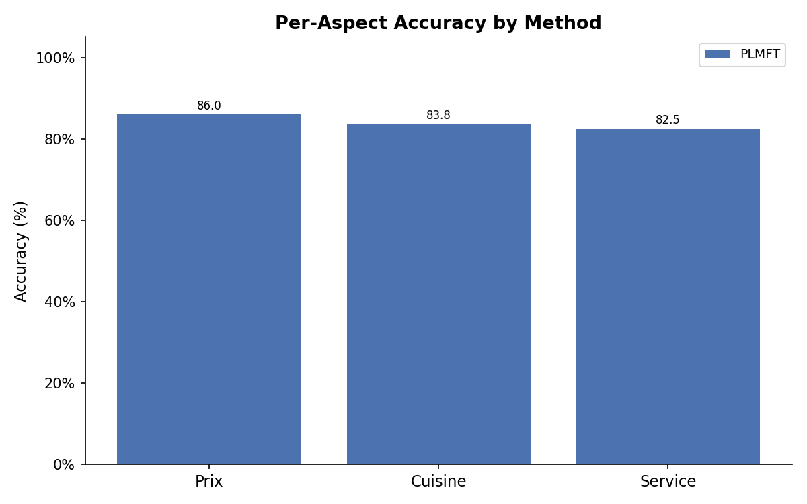
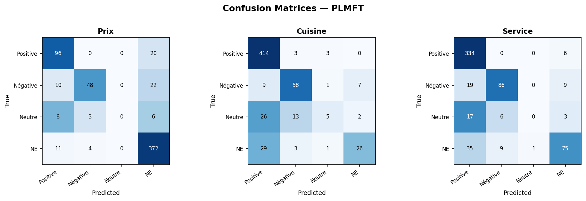

# French Restaurant Review — Aspect-Based Sentiment Analysis

Aspect-Based Sentiment Analysis (ABSA) on French restaurant reviews scraped from TripAdvisor.
Given a review, the model classifies the expressed opinion on three aspects — **Prix** (price), **Cuisine**, **Service** — into one of four labels: `Positive`, `Négative`, `Neutre`, or `NE` (not expressed).

We compare two approaches: a fine-tuned CamemBERT model and a zero/few-shot LLM via Ollama.

---

## Results

Evaluated on the validation split (~600 reviews). Numbers are macro-averaged across 5 runs for PLMFT.

| Method | Prix acc | Cuisine acc | Service acc | **Macro acc** | **Macro F1** |
|---|---|---|---|---|---|
| LLM zero-shot (Qwen2.5-7B-Instruct Q4) | ~70% | ~74% | ~60% | ~65%† | — |
| LLM 3-shot (Qwen2.5-7B-Instruct Q4) | — | — | — | — | — |
| **CamemBERT fine-tuned** | **86.0%** | **83.8%** | **82.5%** | **84.1%** | **60.4%** |

> † LLM numbers estimated from 50-sample evaluation; full 600-sample run pending.





---

## Architecture

We went with **CamemBERT fine-tuning** as our primary approach over zero-shot LLMs for three reasons: lower inference cost, faster prediction, and consistently better accuracy on narrow classification tasks.

### Model

```
CamemBERT (shared encoder)
        │
   [CLS token]
        │
   Dropout (0.3)
   ┌────┴────┬────────┐
 Linear    Linear   Linear
  (4)       (4)      (4)
   │         │        │
  Prix    Cuisine  Service
```

- **Encoder**: `almanach/camembert-base` — French BERT, chosen over multilingual mBERT for better French semantic coverage
- **Multi-head output**: one linear head per aspect, all sharing the same encoder (single forward pass, 3× faster than three independent models)
- **Loss**: sum of three CrossEntropyLoss terms, one per aspect

### Hyperparameters

| Parameter | Value |
|---|---|
| Max sequence length | 128 |
| Batch size | 8 |
| Epochs | 3 |
| Learning rate | 2e-5 (AdamW) |
| Dropout | 0.3 |

---

## Experiments & Ablations

Several variants were tested and discarded:

- **max_len 128 → 256**: doubled compute time for +2–3% accuracy — not worth it
- **Multi-layer heads (Linear → ReLU → Linear)**: no measurable improvement on validation
- **Linear warmup scheduler**: no gain over constant lr on this dataset size
- **More epochs**: marginal accuracy gain, significant time cost
- **Dropout tuning**: 0.1, 0.2, 0.4 all tested — 0.3 gave best stability/performance tradeoff

---

## Usage

### Install

```bash
pip install -r requirements.txt
```

Ollama must be running locally for the LLM method: `ollama pull qwen3:1.7b`

### Run

```bash
cd src

# Fine-tuned CamemBERT (default)
python runproject.py --method=PLMFT --n_runs=5

# LLM zero-shot
python runproject.py --method=LLM

# LLM 3-shot
python runproject.py --method=LLM --few_shot=True

# Save predictions to results.json for visualization
python runproject.py --method=PLMFT --save_results=True

# GPU
python runproject.py --method=PLMFT --device=0
```

### Visualize

```bash
cd src
python visualize.py --results_path=../results.json

# Compare multiple runs (e.g. PLMFT vs LLM)
python visualize.py --results_path=../results_plmft.json --compare ../results_llm.json
```

---

## Data

TripAdvisor reviews from French restaurants (Grenoble, Lyon, Annecy, Valence area).

| Split | Size |
|---|---|
| Train | ~4,000 reviews |
| Val/Test | ~600 reviews |

Each row: `Restaurant`, `Note`, `Prix`, `Cuisine`, `Service`, `Avis` (review text), `URL`.

---

## Authors

Mohamed Mchaouri · Duc Khoi Nguyen
